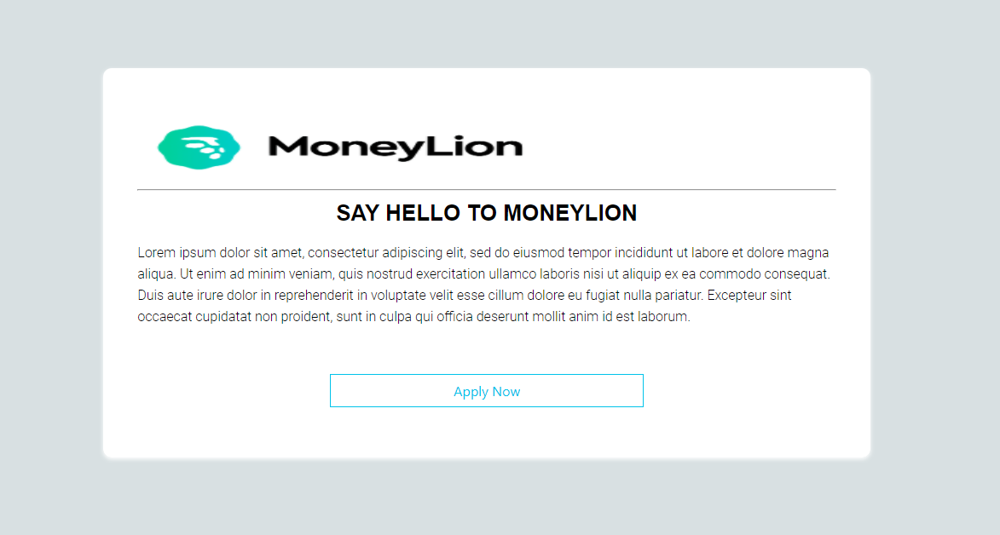

# HomeAssignment

Want to run this app on your local environment? here is the clone 

## git clone https://github.com/amirCodes/HomeAssignment2.git

cd to HomeAssignment2 

## npm start

Runs the app in the development mode. 
Open [http://localhost:3000](http://localhost:3000) to view it in the browser.

##    *******   Here another app/UI design for the assignment can check online  ********

# HomeAssignment2

Want to run this app on your local environment? here is the clone 

## git clone https://github.com/amirCodes/HomeAssignment2.git

cd to HomeAssignment2 

## npm start

demo URL
## https://home-assignment2.vercel.app/

getHub URL

## https://github.com/amirCodes/HomeAssignment2

You are required to create a single page application using ReactJs framework to onboard
users to the Mone\Lion Account.
The onboarding flow consists of 4 screens.
1. Welcome Screen (onboard-test.mone\lion.com/welcome)
2. Personal Details (onboard-test.mone\lion.com/personal)
3. Date of Birth (onboard-test.mone\lion.com/dob)
4. Agreements (onboard-test.mone\lion.com/agreement)